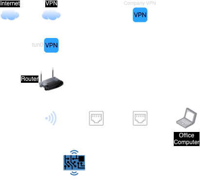

# raspi-vpn-router
RasPi as VPN router with OpenVPN  
This project helps you to setup a VPN router with your RasPi and share the internet connection through your VPN provider.

### Prerequisites

1. RaspberryPI with WiFi and Ethernet
2. MicroSD card (8 GB or larger) with Raspberry Pi OS installed
3. Router and your internet provider
4. Ethernet and USB micro cable
5. Your VPN provider
6. Your office or private computer

### Software

1. Raspberry Pi OS (Lite version is enough, as you'll be configuring it via terminal)
2. OpenVPN
3. iptables for setting up routing and firewall rules
4. dnsmasq for DHCP and DNS services (optional but recommended)
5. netfilter-persistent to save firewall rules across reboot
6. dhcpcd (default for managing Ethernet interfaces on Raspberry Pi)

## RasPi

1. Prepare the hardware and software above
2. Run `sudo raspi-config` and setup your Wireless connection with your provider
3. Download your VPN configuration and copy to /etc/openvpn folder in RasPi
4. Test your VPN connection with `sudo openvpn /etc/openvpn/vpn.ovpn`
5. Edit your VPN connection  
- Remove `nonbind`
- Add `local 192.168.0.X` (your RasPi IP)
- Set your authentication method e.g., via config file

## Office Computer

1. Disable wireless
2. Connect to RasPi with ethernet cable
3. Set your ethernet IP configuration:  
  - Static IP: 192.168.4.2
  - Netmask: 255.255.255.0
  - Gateway: 192.168.4.1
  - DNS: 8.8.8.8, 8.8.4.4
4. Check your internet connection